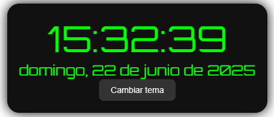

# ⏰ Reloj Digital en JavaScript

Este es un proyecto simple de **reloj digital en tiempo real**, creado con HTML, CSS y JavaScript.

## 🎯 Características

- Muestra la **hora actual en formato 24 horas**
- Muestra la **fecha completa en español**
- Incluye **segundos**
- Fuente tipo digital (`Orbitron`)
- Selector de **tema claro/oscuro**
- Diseño moderno, centrado y responsivo

## 🖥️ Vista en línea

👉 [Ver Reloj en GitHub Pages](https://edgarverdeza.github.io/RelojDigital/)

## 📷 Captura



## 🚀 Cómo usar

1. Clona este repositorio:
   ```bashv
   git clone https://github.com/EdgarVerdeza/RelojDigital.git
